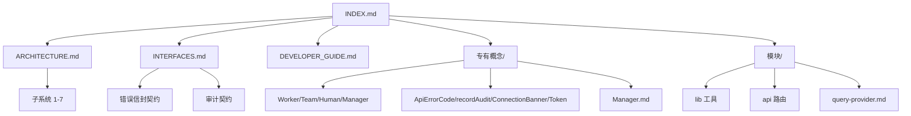

# TaDashboard Wiki 索引

TaDashboard 是 HiClaw 集群的 Web 管理面板。本 Wiki 涵盖架构、接口、开发、概念与模块参考。

## 角色路径

| 我想… | 起点 |
|---|---|
| 了解项目整体 | [ARCHITECTURE.md](ARCHITECTURE.md) |
| 集成到其他系统 / 找接口 | [INTERFACES.md](INTERFACES.md) |
| 改代码 / 提交 PR | [DEVELOPER_GUIDE.md](DEVELOPER_GUIDE.md) |
| 部署到 k3s | `docs/k3s-deployment.md`（在仓库根） |
| 理解某个概念 | [专有概念/](专有概念/) |
| 找某个文件做什么 | [模块/](模块/) |

## 文档结构

## 专有概念

| 概念 | 文档 | 关键点 |
|---|---|---|
| Worker | [Worker.md](专有概念/Worker.md) | 状态机、变异操作、exposedPorts |
| Team | [Team.md](专有概念/Team.md) | leader / humanMembers / Matrix 房间 |
| Human | [Human.md](专有概念/Human.md) | 权限级别 1-3 |
| Manager | [Manager.md](专有概念/Manager.md) | （待写） |
| Worker | [Worker.md](专有概念/Worker.md) | 状态机、变异操作、exposedPorts |
| Team | [Team.md](专有概念/Team.md) | leader / humanMembers / Matrix 房间 |
| Human | [Human.md](专有概念/Human.md) | 权限级别 1-3 |
| Manager | [Manager.md](专有概念/Manager.md) | 跨 Team 协调 |
| ApiErrorCode | [ApiErrorCode.md](专有概念/ApiErrorCode.md) | 12 种错误码统一约定 |
| recordAudit | [recordAudit.md](专有概念/recordAudit.md) | 客户端审计写入器 |
| ConnectionBanner | [ConnectionBanner.md](专有概念/ConnectionBanner.md) | 错误降级 UI |
| Token 持久化 | [Token-持久化策略.md](专有概念/Token-持久化策略.md) | Matrix token 三种策略 |
| Agent 行业趋势 | [Agent-行业趋势调研.md](专有概念/Agent-行业趋势调研.md) | A2A / MCP / A2UI / Mission Control 调研与本项目映射 |

## 模块参考

| 模块 | 文档 | 关键点 |
|---|---|---|
| `src/lib/api-errors.ts` | [api-errors.md](模块/api-errors.md) | 12 种 ApiErrorCode + 信封 + fromResponse + describeApiError |
| `src/lib/audit.ts` | [audit.md](模块/audit.md) | recordAudit 客户端写入器 |
| `src/lib/hiclaw-api.ts` | [hiclaw-api.md](模块/hiclaw-api.md) | HiClaw Controller 客户端 API 层 |
| `src/lib/matrix-api.ts` | [matrix-api.md](模块/matrix-api.md) | Matrix Client-Server API 客户端 |
| `src/lib/hiclaw-store.ts` | [hiclaw-store.md](模块/hiclaw-store.md) | 连接状态 + 自动重连 |
| `src/lib/matrix-store.ts` | [matrix-store.md](模块/matrix-store.md) | 登录状态 + Token 持久化 |
| `prisma/schema.prisma` | [db.md](模块/db.md) | SQLite schema + Prisma Client 单例 |
| `src/lib/query-provider.tsx` | [query-provider.md](模块/query-provider.md) | React Query Provider 配置 |
| `src/lib/ui-store.ts` | [ui-store.md](模块/ui-store.md) | Feature flag (modern chat / modern chrome) 持久化 |
| `src/lib/typing.ts` | [typing.md](模块/typing.md) | 打字节流 publisher + 失活收集 |
| `src/lib/sanitize.ts` | [sanitize.md](模块/sanitize.md) | sanitizeHtml + renderInlineMarkdown (remark/rehype 管线) |
| `src/lib/a2ui.ts` | [a2ui.md](模块/a2ui.md) | A2UI payload 解析 + 渲染器 |
| `src/app/api/activity/route.ts` | [activity-route.md](模块/activity-route.md) | Activity Feed GET 端点（合并 AuditLog） |
| `src/lib/worker-metrics.ts` | [worker-metrics.md](模块/worker-metrics.md) | Worker 资源指标 (CPU/内存/磁盘) 拉取 + MiniCard/Group 组件 |
| `src/lib/phase-timeline.ts` | [phase-timeline.md](模块/phase-timeline.md) | 从 events 流抽取 phase 变更时间线 |
| `src/hooks/use-trace-retry.ts` | [trace-retry.md](模块/trace-retry.md) | 1s/2s/4s 指数退避重试 + pause/cancel |
| `src/hooks/use-worker-bulk-action.ts` | [worker-bulk-action.md](模块/worker-bulk-action.md) | 6 动作批量执行 + 进度条 + 失败重试 |
| `src/components/dashboard/surface-shell.tsx` | [ui-shell.md](模块/ui-shell.md) | SurfaceShell / EmptyState / SkeletonGrid 共享卡片骨架 |
| `src/lib/format.ts` | [ui-shell.md](模块/ui-shell.md) | 共享格式 (formatPct / pctColorClass / timeAgo) |
| `src/hooks/use-hiclaw-store-selectors.ts` | [ui-shell.md](模块/ui-shell.md) | useShallow 选择器，避免无关 store 重渲染 |
| `src/components/dashboard/section-error-boundary.tsx` | [ui-shell.md](模块/ui-shell.md) | 按 section 隔离 crash 的错误边界 |
| `src/app/api/hiclaw/workers/[name]/fallback-helper.ts` | [ui-shell.md](模块/ui-shell.md) | metrics/events controller 降级共享逻辑 |
| `src/lib/query-config.ts` | [query-config.md](模块/query-config.md) | React Query 共享默认值 (staleTime/retry/refetch) |
| `src/hooks/use-reset-flag.ts` | [query-config.md](模块/query-config.md) | transient 布尔状态 hook (替代 setTimeout 反模式) |

## 文档约定

- **代码引用**：使用 `file:line` 格式（如 `src/lib/audit.ts:34-52`）便于跳转
- **状态/流程图**：Mermaid，遵循 Mermaid 标签格式（单行 + 引号包裹特殊字符）
- **表格**：每列 ≤ 30 字符；过长内容放到描述里
- **错误码 / 端点表**：源数据从代码直接抄，不臆造

## 仓库其他文档

| 文档 | 位置 | 用途 |
|---|---|---|
| README | `/README.md` | 项目介绍、5 分钟上手 |
| k3s 部署 | `docs/k3s-deployment.md` | k3s + Higress 部署手册 |
| 贡献指南 | `/CONTRIBUTING.md` | PR 流程、测试要求 |
| 安全策略 | `/SECURITY.md` | 漏洞上报 |
| 许可 | `/LICENSE` | Apache-2.0 |
