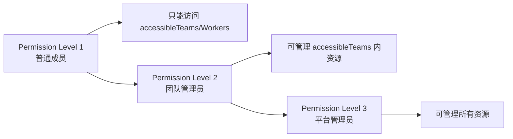
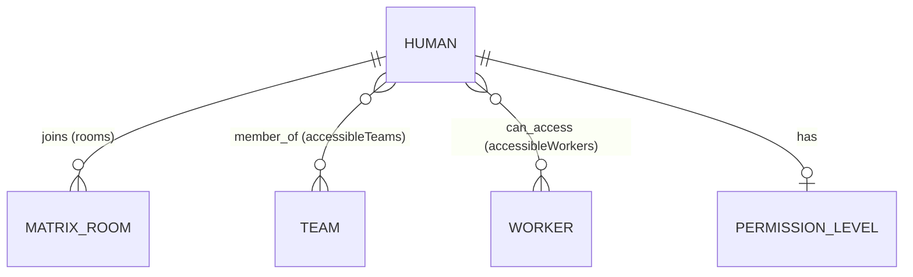

# Human

HiClaw 集群中的人类用户，作为 Team 的成员加入 Matrix 房间，与 Worker 协作。Human 在权限模型里分 3 级，决定其能访问哪些 Team 和 Worker。

## 什么是 Human？

Human 是 HiClaw Controller 中的人类用户实体，每个 Human 在 Matrix 协议下对应一个账号，可以被加入到 Team 房间，作为指令发出方或监督者。

**关键特征**：
- 有 Matrix 用户账号（`@<name>:hiclaw.local`）
- 有 `permissionLevel`：1（普通）/ 2（团队管理员）/ 3（平台管理员）
- 可访问 `accessibleTeams[]` 和 `accessibleWorkers[]`
- `initialPassword` 由 Controller 生成（首次登录后需修改）

## 代码位置

| 方面 | 位置 |
|---|---|
| 客户端类型 | `src/lib/hiclaw-api.ts:61-75` |
| 客户端方法 | `src/lib/hiclaw-api.ts:319-334` |
| 代理路由 | `src/app/api/hiclaw/humans/{route,[name]}/route.ts` |
| Hooks | `src/hooks/use-hiclaw-humans.ts` + `use-hiclaw-mutations.ts:236-290` |
| UI 组件 | `src/components/dashboard/sections/humans-section.tsx`（卡片/表格双视图） |
| 审计白名单 | `src/lib/audit.ts:14-16` |

## 结构

```typescript
interface HumanResponse {
  name: string;                  // 唯一名
  phase: HumanPhase;             // 'Pending' | 'Active' | 'Failed'
  displayName: string;           // 展示名
  matrixUserID: string;          // @<name>:homeserver
  initialPassword: string;       // 初始密码（首次登录后重置）
  rooms: string[];               // 已加入的 Matrix 房间
  message: string;
  permissionLevel?: 1 | 2 | 3;   // 权限级别
  accessibleTeams?: string[];    // 可访问的 team 列表
  accessibleWorkers?: string[];  // 可访问的 worker 列表
  groupAllowFrom?: string[];
  email?: string;
  note?: string;
}
```

### 关键字段

| 字段 | 类型 | 描述 | 约束 |
|---|---|---|---|
| `name` | string | 唯一名 | 不可变 |
| `permissionLevel` | enum | 权限级别 | 1 普通 / 2 团队管理员 / 3 平台管理员 |
| `accessibleTeams` | string[] | 团队访问白名单 | 必须在 teams 中存在 |
| `accessibleWorkers` | string[] | worker 访问白名单 | 必须在 workers 中存在 |
| `rooms` | string[] | Matrix 房间 | 反映当前已加入的 room ID |

## 权限模型



`SecuritySection` 的"权限矩阵"区块（`src/components/dashboard/sections/security-section.tsx:230+`）以人类可读形式展示这个模型。

## 关系



## 变异操作

| Action | HTTP | 用途 | 审计 |
|---|---|---|---|
| `create` | POST `/humans` | 创建（含 `permissionLevel` / `accessibleTeams` / `accessibleWorkers`） | `human.create` |
| `update` | PUT `/humans/{name}` | 修改（部分字段） | `human.update` |
| `delete` | DELETE `/humans/{name}` | 删除 | `human.delete` |
