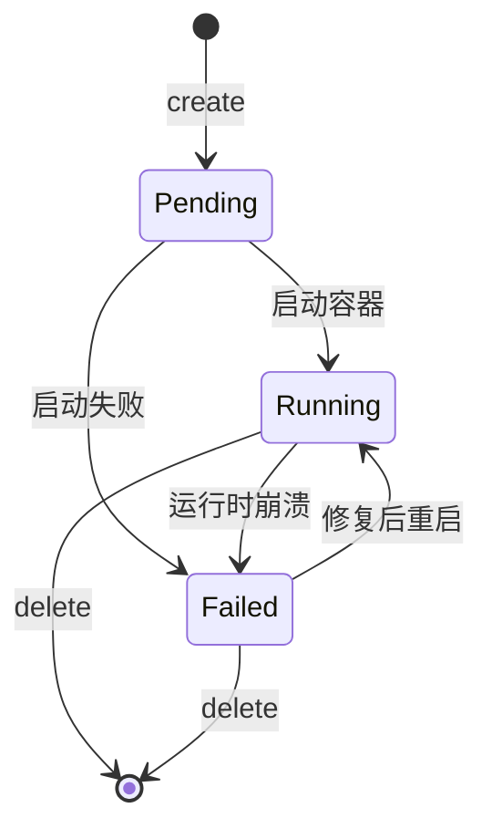
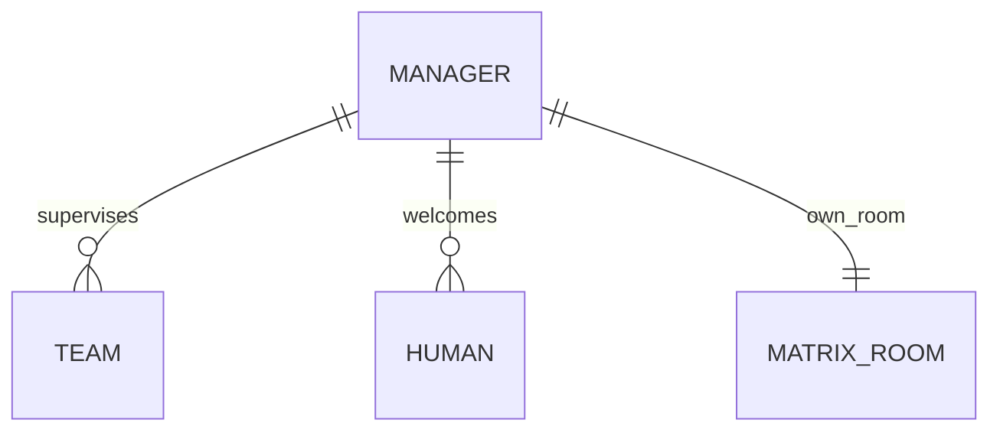

# Manager

HiClaw 集群中的"超级管理者"，负责协调多个 Team，处理跨 Team 任务并提供全局视角。Manager 与 Worker 类似（都是 Matrix 用户），但承担更高层级的角色。

## 什么是 Manager？

Manager 是 HiClaw Controller 管理的特殊实体，地位高于 Worker。它的主要职责：
- **跨 Team 协调**：当某个任务需要多个 Team 的 worker 配合时，Manager 是分发中枢
- **全局视角**：可选地观察所有 Team 的状态
- **欢迎消息**：当 Human 第一次加入时，Manager 可以发送欢迎语（`welcomeSent` 标志）
- **Platform Admin 接入点**：permissionLevel=3 的 human 通过 Manager 接收平台级通知

**关键特征**：
- 与 Worker 结构相似，但 lifecycle 更简单（`Running` / `Pending` / `Failed`）
- 通常集群部署 1-2 个 Manager，多 Manager 场景尚在测试
- 有 `welcomeSent` 字段追踪欢迎流程
- 加载自己的 skills 集合（与 worker 技能隔离）

## 代码位置

| 方面 | 位置 |
|---|---|
| 客户端类型 | `src/lib/hiclaw-api.ts:77-90` |
| Phase 枚举 | `src/lib/hiclaw-api.ts:13-14` |
| 客户端方法 | `src/lib/hiclaw-api.ts:337-352` |
| 代理路由 | `src/app/api/hiclaw/managers/{route,[name]}/route.ts` |
| Hooks | `src/hooks/use-hiclaw-managers.ts` + `use-hiclaw-mutations.ts:299-339` |
| UI 组件 | `src/components/dashboard/sections/managers-section.tsx` |
| 审计白名单 | `src/lib/audit.ts:17-19` |

## 结构

```typescript
interface ManagerResponse {
  name: string;
  phase: ManagerPhase;           // 'Running' | 'Pending' | 'Failed'
  state: ManagerState;           // 'Running' | 'Sleeping' | 'Stopped'
  model: string;
  runtime: string;
  image: string;
  matrixUserID: string;
  roomID: string;
  version: string;
  message: string;
  welcomeSent: boolean;
  skills?: string[];
}
```

### 关键字段

| 字段 | 类型 | 描述 |
|---|---|---|
| `name` | string | 唯一名 |
| `phase` | enum | 生命周期阶段 |
| `state` | enum | 运行时状态 |
| `matrixUserID` | string | Matrix 用户 |
| `welcomeSent` | boolean | 是否已向所有新加入的 Human 发送欢迎消息 |
| `skills` | string[] | Manager 加载的 skills（独立于 worker） |

## 生命周期



与 Worker 相比更简单：Manager 不需要 sleep/wake 机制（`state` 字段保留但 unused）。

## 关系



## 变异操作

| Action | HTTP | 用途 | 审计 |
|---|---|---|---|
| `create` | POST `/managers` | 创建 | `manager.create` |
| `update` | PUT `/managers/{name}` | 修改 model/runtime/image | `manager.update` |
| `delete` | DELETE `/managers/{name}` | 删除 | `manager.delete` |