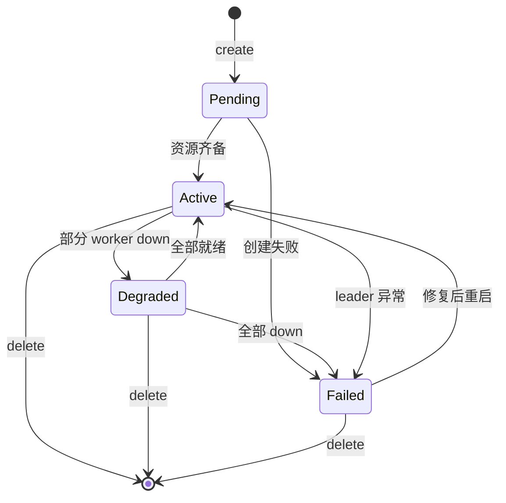
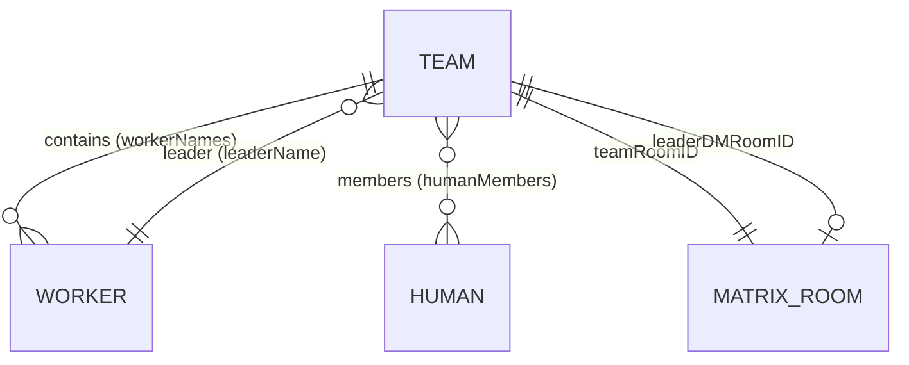

# Team

HiClaw 集群中的协作单元，对应一组 Worker 加上一个人类（leader）的协调组织。Team 在 Matrix 中表现为一个房间（`!team-<name>:homeserver`），所有成员在该房间内通过 Matrix 协议协作。

## 什么是 Team？

Team 是 HiClaw Controller 管理的高级抽象，把"一组 worker + 一个 leader + 一组 human 成员 + 一个 Matrix 房间"打包成一个对象。Team 提供：
- **统一 Matrix 房间**：所有 worker + human + leader 共享一个 `team-room`，消息互通
- **leader 模式**：可选的 leader worker 接收 human 指令并派发给其他 worker
- **心跳机制**：可选 `leaderHeartbeat`，leader 周期性输出状态
- **空闲回收**：`workerIdleTimeout` 后台机制

**关键特征**：
- 一个 team 至少包含一个 leader worker（`leaderName`）
- 包含 `humanMembers[]`（可选，关联到 Humans）
- `teamRoomID` / `leaderDMRoomID` 两个关键 Matrix 房间
- `leaderReady` / `readyWorkers` / `totalWorkers` 统计状态

## 代码位置

| 方面 | 位置 |
|---|---|
| 客户端类型 | `src/lib/hiclaw-api.ts:41-59` |
| 客户端方法 | `src/lib/hiclaw-api.ts:294-316` |
| 代理路由 | `src/app/api/hiclaw/teams/{route,[name]}/route.ts` |
| Hooks | `src/hooks/use-hiclaw-teams.ts`（查询）+ `use-hiclaw-mutations.ts:165-227`（变异） |
| UI 组件 | `src/components/dashboard/sections/teams-section.tsx` |
| 审计白名单 | `src/lib/audit.ts:11-13` |

## 结构

```typescript
interface TeamResponse {
  name: string;                  // 唯一名
  teamName: string;              // 展示名
  phase: TeamPhase;              // 'Pending' | 'Active' | 'Degraded' | 'Failed'
  description: string;
  admin: { name: string } | null;  // 兼容字段：实际为 leader
  humanMembers: string[];        // human 名字列表
  leaderName: string;            // worker 名
  leaderHeartbeat: { enabled: boolean; every: string } | null;
  workerIdleTimeout: string;     // duration 字符串，如 "10m"
  teamRoomID: string;            // !team-<name>:homeserver
  leaderDMRoomID: string;        // leader 私聊房间
  leaderReady: boolean;
  readyWorkers: number;
  totalWorkers: number;
  message: string;
  workerNames: string[];
  workerExposedPorts: Record<string, ExposedPort[]>;
}
```

### 关键字段

| 字段 | 类型 | 描述 | 约束 |
|---|---|---|---|
| `name` | string | 唯一名 | 不可变 |
| `leaderName` | string | leader worker | 必须在 workers 中存在 |
| `humanMembers` | string[] | 人类成员 | 必须在 humans 中存在 |
| `workerNames` | string[] | 关联 worker | 必须在 workers 中存在 |
| `teamRoomID` | string | Matrix 房间 | 由 Controller 分配 |
| `phase` | enum | 阶段 | 见状态机 |

## 生命周期



## 关系



## 变异操作

| Action | HTTP | 用途 | 审计 |
|---|---|---|---|
| `create` | POST `/teams` | 创建（body 接受 `leader` 或旧字段 `admin`） | `team.create` |
| `update` | PUT `/teams/{name}` | 修改 | `team.update` |
| `delete` | DELETE `/teams/{name}` | 删除 | `team.delete` |

注意：dashboard 在 `src/lib/hiclaw-api.ts:302-310` 做了兼容：`createTeam` 时如果传了 `admin` 但没有 `leader`，会自动把 `admin` 提升为 `leader`。
