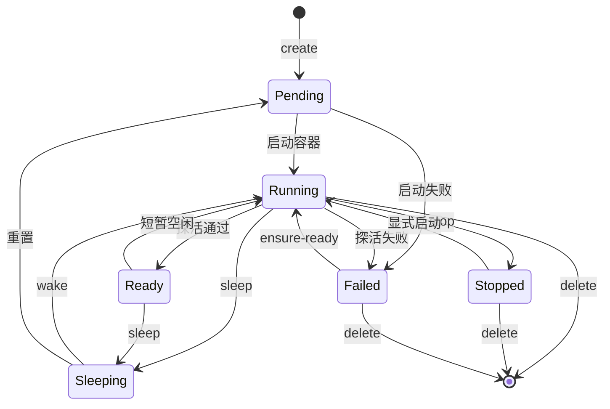
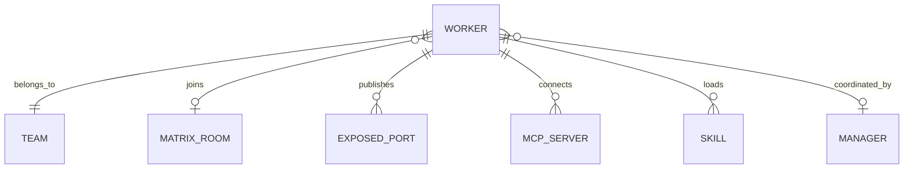

# Worker

HiClaw 集群中的 AI 代理实例，是最核心的计算单元。Worker 在 Matrix 协议下作为一个虚拟用户存在，可以被加入到 Team 房间、接收任务、调用工具、暴露 HTTP 端口给外部调用。

## 什么是 Worker？

Worker 是 HiClaw Controller 管理的运行时实例，对应一个真实的 LLM agent 进程（openclaw / copaw / hermes / openhuman 四种 runtime 之一）。它既可以是常驻服务（被 Higress 反向代理），也可以按需唤醒/休眠。

**关键特征**：
- 有 Matrix 用户账号（`@<name>:hiclaw.local`），能加入房间
- 有 `exposedPorts`，可被外部访问（Higress 路由）
- 有生命周期：`Pending → Running → Ready / Sleeping / Stopped / Failed`
- 有 `team` 归属（一个 worker 属于一个 team，可以是 leader 或普通成员）
- 可加载 skills、连接 MCP servers

## 代码位置

| 方面 | 位置 |
|---|---|
| 客户端类型 | `src/lib/hiclaw-api.ts:21-39` (`WorkerResponse` / `CreateWorkerRequest` / `UpdateWorkerRequest`) |
| Phase 枚举 | `src/lib/hiclaw-api.ts:8-9` (`WorkerPhase` / `WorkerState`) |
| Runtime 枚举 | `src/lib/hiclaw-api.ts:10` (`WorkerRuntime = 'openclaw' \| 'copaw' \| 'hermes' \| 'openhuman'`) |
| 客户端方法 | `src/lib/hiclaw-api.ts:264-291` (`listWorkers` / `getWorker` / `createWorker` / `updateWorker` / `deleteWorker` / `wakeWorker` / `sleepWorker` / `ensureReadyWorker` / `getWorkerStatus`) |
| 代理路由 | `src/app/api/hiclaw/workers/{route,[name]/{route,wake,sleep,ensure-ready,status}}` |
| Hooks（查询） | `src/hooks/use-hiclaw-workers.ts` / `use-hiclaw-worker-detail.ts` |
| Hooks（变异） | `src/hooks/use-hiclaw-mutations.ts:34-156` |
| UI 组件 | `src/components/dashboard/sections/workers-section.tsx` |
| 审计白名单 | `src/lib/audit.ts:5-10` |

## 结构

```typescript
interface WorkerResponse {
  name: string;                  // 唯一名
  phase: WorkerPhase;            // 生命周期阶段
  state: WorkerState;            // 运行时状态
  containerManaged: boolean;     // 是否由 HiClaw 容器管理
  model: string;                 // LLM 模型标识 (e.g. "sonnet", "haiku")
  runtime: WorkerRuntime;        // openclaw / copaw / hermes / openhuman
  image: string;                 // 容器镜像
  containerState: string;        // 容器运行时状态
  matrixUserID: string;          // @<name>:homeserver
  roomID: string;                // Matrix 房间 ID
  message: string;               // 状态描述
  exposedPorts?: ExposedPort[];  // 对外暴露的 HTTP 端口
  team: string;                  // 所属 team name
  role: string;                  // "leader" / "worker"
  skills?: string[];             // 加载的 skill 列表
  mcpServers?: { name: string; url: string; transport: string }[];
  version?: string;
}
```

### 关键字段

| 字段 | 类型 | 描述 | 约束 |
|---|---|---|---|
| `name` | string | 唯一名，URL 段编码 | 不可变（rename 不支持） |
| `phase` | enum | 生命周期阶段 | 见状态机 |
| `state` | enum | 运行时状态 | `Running` / `Sleeping` / `Stopped` |
| `team` | string | 归属 team | 必须在 teams 中存在 |
| `matrixUserID` | string | Matrix 用户 | 形如 `@<name>:<homeserver>` |
| `exposedPorts` | ExposedPort[] | 对外端口 | 每个含 `port` + `domain` |

## 生命周期



### 状态描述

| Phase | 描述 | 允许的转换 |
|---|---|---|
| `Pending` | 已创建但未启动 | → Running / Failed |
| `Running` | 容器已启动，agent 进程在跑 | → Ready / Sleeping / Stopped / Failed |
| `Ready` | agent 已注册到 Matrix 并就绪 | → Running / Sleeping |
| `Sleeping` | 容器暂停，agent 暂停接收任务 | → Running / Pending |
| `Stopped` | 容器停止 | → Running / delete |
| `Failed` | 启动或运行失败 | → Running (ensure-ready) / delete |

## 关系



| 关联概念 | 关系 | 描述 |
|---|---|---|
| Team | 属于 | 一个 worker 属于一个 team |
| Matrix Room | 加入 | 每个 worker 至少加入自己的 1:1 房间 |
| ExposedPort | 发布 | 可被 Higress 反向代理 |
| Manager | 被协调 | Manager 监控 worker 状态 |

## 变异操作

| Action | HTTP | 用途 | 审计 |
|---|---|---|---|
| `create` | POST `/workers` | 创建 | `worker.create` |
| `update` | PUT `/workers/{name}` | 修改 | `worker.update` |
| `delete` | DELETE `/workers/{name}` | 删除 | `worker.delete` |
| `wake` | POST `/workers/{name}/wake` | 唤醒 | `worker.wake` |
| `sleep` | POST `/workers/{name}/sleep` | 休眠 | `worker.sleep` |
| `ensure-ready` | POST `/workers/{name}/ensure-ready` | 确保就绪 | `worker.ensure-ready` |
