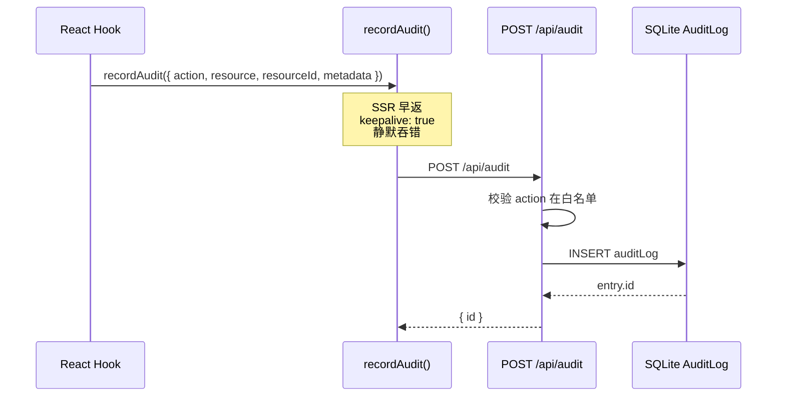

# recordAudit 与 AuditLog

TaDashboard 把所有破坏性操作（创建/更新/删除/唤醒/休眠资源）持久化到本地 SQLite。本文档描述这套审计契约。

## 数据流



## Action 白名单

17 种 action，分 5 类（`src/lib/audit.ts:4-21` 与 `src/app/api/audit/route.ts:5-23` 必须同步）：

| 类别 | Action |
|---|---|
| worker | `worker.create` / `worker.update` / `worker.delete` / `worker.wake` / `worker.sleep` / `worker.ensure-ready` |
| team | `team.create` / `team.update` / `team.delete` |
| human | `human.create` / `human.update` / `human.delete` |
| manager | `manager.create` / `manager.update` / `manager.delete` |
| consumer | `consumer.create` / `consumer.delete` |

> ⚠️ **两端必须同步**：客户端 `AuditAction` union + 服务端 `ALLOWED_ACTIONS` Set。任何缺失都会导致 POST 返回 `BAD_REQUEST: Unsupported audit action`。

## Payload

```typescript
interface AuditPayload {
  action: AuditAction;             // 必填，必须在白名单
  resource: string;                // 必填，非空字符串（如 "worker" / "team"）
  resourceId?: string;             // 资源名（如 worker.name）
  actor?: string;                  // 行为发起者（一般是用户 display name）
  metadata?: Record<string, unknown>;  // 上下文，如 { oldPhase, newPhase, model, runtime }
}
```

服务端会：
- 拒绝 `action` 不在白名单 → 400 BAD_REQUEST
- 拒绝 `resource` 非字符串或空 → 400 BAD_REQUEST
- 把 `metadata` 经 `JSON.stringify` 存为 SQLite TEXT（如果是对象）或存原值（如果是字符串）
- 把 `resourceId` / `actor` 强制为字符串或 null

## AuditLog 表结构

`prisma/schema.prisma`：

```prisma
model AuditLog {
  id          Int      @id @default(autoincrement())
  action      String
  resource    String
  resourceId  String?
  actor       String?
  metadata    String?  // JSON 字符串
  createdAt   DateTime @default(now())

  @@index([resource, createdAt])
  @@index([action, createdAt])
}
```

索引按 (resource, createdAt) 和 (action, createdAt)，便于按资源/动作查询。

## recordAudit 行为约束

`recordAudit()` (`src/lib/audit.ts`) 的实现有四个关键特性：

### 1. SSR 早返
```typescript
if (typeof window === "undefined") return;
```
服务端渲染期间无 window，立即返回，避免误打 fetch。在 mutation hook 的 onSuccess 中调用前要确认代码路径在客户端触发。

### 2. keepalive: true
```typescript
keepalive: true,
```
即使页面正在导航离开（unload），浏览器也会把请求发完。这对"删除资源 → 用户立即跳转"场景重要。

### 3. 静默吞错
```typescript
} catch {
  // intentionally swallow
}
```
审计写入失败不影响主流程。业务失败优先于审计丢失。

### 4. 状态码非 2xx 不抛
`recordAudit` 不检查 `res.ok`。即使服务端返回 4xx/5xx（例如白名单拒绝、DB 写失败），也不会进入 catch —— `fetch` 本身不抛网络错。需要服务端正确返回 2xx 才算成功。

## 调用位置

| Mutation | 文件 | 行号 |
|---|---|---|
| `useCreateWorker` | `src/hooks/use-hiclaw-mutations.ts` | 34-69 |
| `useUpdateWorker` | 同上 | 71-99 |
| `useDeleteWorker` | 同上 | 101-130 |
| `useWakeWorker` | 同上 | 132-148 |
| `useSleepWorker` | 同上 | 150-156 |
| `useEnsureReadyWorker` | 同上 | 158-163 |
| `useCreateTeam` | 同上 | 165-186 |
| `useUpdateTeam` | 同上 | 188-209 |
| `useDeleteTeam` | 同上 | 211-227 |
| `useCreateHuman` | 同上 | 236-251 |
| `useUpdateHuman` | 同上 | 253-269 |
| `useDeleteHuman` | 同上 | 271-290 |
| `useCreateManager` | 同上 | 299-309 |
| `useUpdateManager` | 同上 | 311-321 |
| `useDeleteManager` | 同上 | 323-339 |
| `useCreateConsumer` | 同上 | 348-365 |

所有调用统一在 `mutation.onSuccess` 中，传入 `metadata: { ... }` 含上下文（如旧/新 phase、target name、batch size）。

## GET 端点

`GET /api/audit?limit=N&resource=worker` 返回最近 N 条（默认 50，上限 200），按 `createdAt desc` 排序。可选 `resource` 过滤。

响应：
```json
{
  "entries": [
    {
      "id": 123,
      "action": "worker.create",
      "resource": "worker",
      "resourceId": "worker-foo",
      "actor": "admin",
      "metadata": "{\"model\":\"sonnet\",\"runtime\":\"openclaw\"}",
      "createdAt": "2026-06-16T10:30:00.000Z"
    }
  ]
}
```

`metadata` 是 JSON 字符串，客户端需 `JSON.parse` 解析。

## 添加新 Action

详见 [DEVELOPER_GUIDE.md](../DEVELOPER_GUIDE.md#添加新的审计-action)。