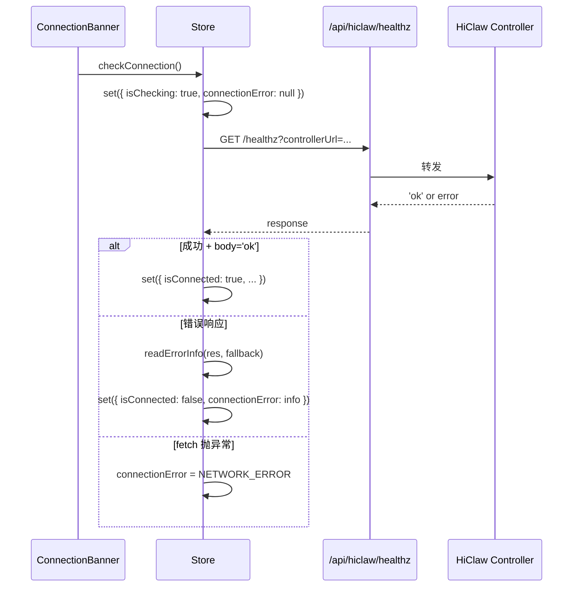

# src/lib/hiclaw-store.ts

HiClaw 连接状态 + 设置的 zustand store。客户端全局唯一。

## 职责

1. 存储 Controller URL（持久化）
2. 跟踪连接状态（isConnected / isChecking / connectionError）
3. 提供 `checkConnection()` 探活方法
4. 管理自动重连定时器
5. 维护最近 5 次连接历史（用于 Settings UI 显示）

## 持久化

| 字段 | 持久化？ |
|---|---|
| `controllerUrl` | ✅ localStorage |
| `autoReconnect` | ✅ localStorage |
| `reconnectInterval` | ✅ localStorage |
| `lastConnectedAt` | ✅ localStorage |
| `isConnected` / `isChecking` / `connectionError` | ❌ 瞬时态 |
| `connectionLatency` | ❌ 瞬时态 |
| `connectionHistory` | ❌ 瞬时态 |
| `settingsOpen` | ❌ UI 瞬时 |

store key: `'hiclaw-store'`

## State

```typescript
interface HiClawState {
  controllerUrl: string;
  isConnected: boolean;
  connectionError: ConnectionErrorInfo | null;
  isChecking: boolean;
  settingsOpen: boolean;
  autoReconnect: boolean;
  reconnectInterval: number;
  lastConnectedAt: number | null;
  connectionLatency: number | null;
  connectionHistory: ConnectionAttempt[];

  setControllerUrl: (url: string) => void;
  checkConnection: () => Promise<boolean>;
  openSettings: () => void;
  closeSettings: () => void;
  setAutoReconnect: (val: boolean) => void;
  setReconnectInterval: (ms: number) => void;
  addConnectionAttempt: (attempt: ConnectionAttempt) => void;
}
```

## 关键方法

### `checkConnection(): Promise<boolean>`



`readErrorInfo(res, fallback)` (`hiclaw-store.ts:41-61`)：
- 尝试解析响应为 JSON
- 找到 `{error: {code, message}}` → 用 envelope
- 找不到 → `{code: 'UNKNOWN', message: fallback}`

### `connectionError` 形状

```typescript
interface ConnectionErrorInfo {
  code: ApiErrorCode | 'NETWORK_ERROR' | 'UNKNOWN';
  message: string;
}
```

详见 [专有概念/ConnectionBanner.md](../专有概念/ConnectionBanner.md)。

### 自动重连

`startAutoReconnect()` (`hiclaw-store.ts:174-191`)：
- 仅在 `autoReconnect=true && !isConnected && !isChecking && !settingsOpen` 时启动
- 定时调用 `checkConnection()`
- `interval` 来自 `reconnectInterval`（默认 15000ms）

订阅 store 变化：
- 进入"应该重连"状态 → `startAutoReconnect()`
- 退出 → `stopAutoReconnect()`
- `reconnectInterval` 变化且在重连中 → 重启（用新 interval）

订阅代码用 `if (typeof window !== 'undefined')` 守护，防止 SSR/build 时执行。

## 调用方

| 组件 | 用途 |
|---|---|
| `connection-banner.tsx` | 读 connection 状态 + 触发 checkConnection / openSettings |
| `settings-dialog.tsx` | 读写 controllerUrl / autoReconnect / reconnectInterval |
| `hi-claw-dashboard.tsx` | 启动时调用 `useHiClawStore.getState().checkConnection()` 做首次探活 |
| `use-hiclaw-*` hooks | 在 fetch 失败时设置 connectionError（部分场景） |

## 测试覆盖

hiclaw-store 暂无单测（vitest 38 用例主要覆盖 api-errors / audit / hiclaw-api / matrix-store / matrix-proxy-helper）。store 测试需 mock zustand persist + 注入 fake fetch。

## 修改注意

1. **持久化字段**：加新字段时考虑是否需要持久化（设置 vs 瞬时态）
2. **`partialize`**：默认 partialize 已存在；新加字段若不持久化，需确保不在 partialize 中
3. **自动重连订阅**：模块级副作用，加新订阅必须 SSR 守护
4. **`readErrorInfo`**：错误码 union 改了同步改 `ConnectionErrorInfo.code`

## 依赖

- `zustand`
- `zustand/middleware` 的 `persist`
- `./api-errors`（仅类型）