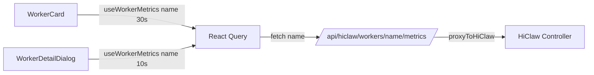

# `worker-metrics` 模块

> 文件位置：`src/lib/worker-metrics.ts` · 路由：`src/app/api/hiclaw/workers/[name]/metrics/route.ts` · 类型：`src/lib/hiclaw-api.ts` · Hook：`src/hooks/use-worker-metrics.ts`

Worker 资源指标（CPU / 内存 / 磁盘）客户端拉取层。

## 数据流



## 类型

```typescript
interface WorkerMetrics {
  cpuPct: number | null;   // 0-100，未采集时 null
  memPct: number | null;
  diskPct: number | null;
  updatedAt: string;        // ISO 8601
}
```

## API 行为

| Controller 响应 | 客户端行为 |
|---|---|
| 200 + JSON | 解析为 `WorkerMetrics` |
| 404 | 返回 `null`（Controller 暂未实现） |
| 5xx / 401 | 抛 `ApiClientError`（含 status + code） |

## 组件

- `MetricsMiniCard`（`src/components/dashboard/worker-metrics-mini-card.tsx`）：3 cell 灰底 mini-card，列表卡片底部用
- `MetricsGroup`（`src/components/dashboard/worker-metrics-group.tsx`）：3 大数字 + 进度条 + "更新于 X 秒前"，详情 dialog 顶部用

颜色阈值：≥90% 玫红 / ≥70% 琥珀 / 其余翠绿。

## 错误降级

- 列表 mini-card：失败时显示 `–` 占位，错误仅写 console（不弹 toast，避免 N 张卡轮询时刷屏）
- 详情 dialog group：失败时显示 `rose-500/5` 背景 Alert "请检查 HiClaw Controller 是否暴露 metrics 端点"

## 测试

`tests/worker-metrics.test.ts`（5 用例）：200 / 404 / 5xx / 401 / URL 编码
