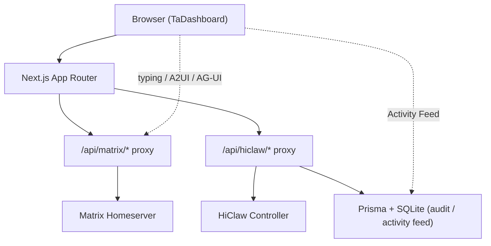
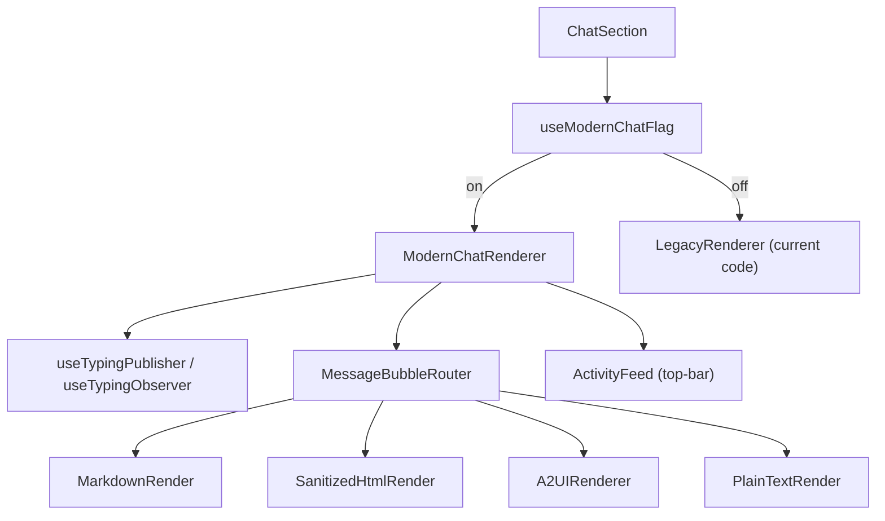
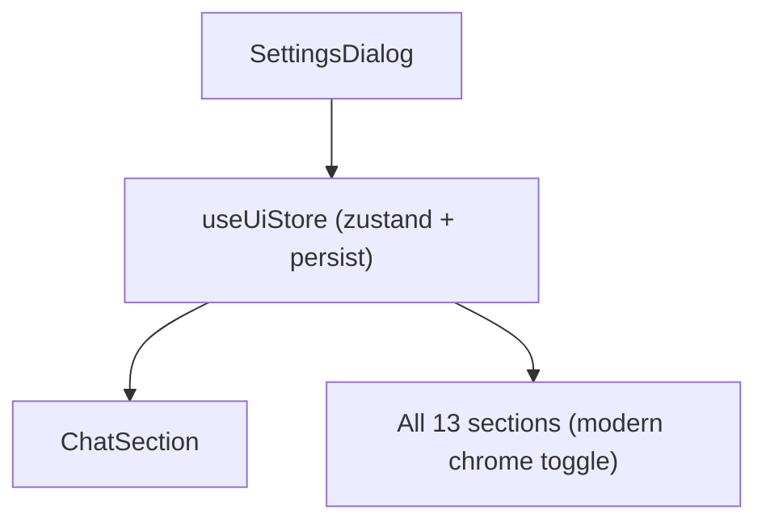
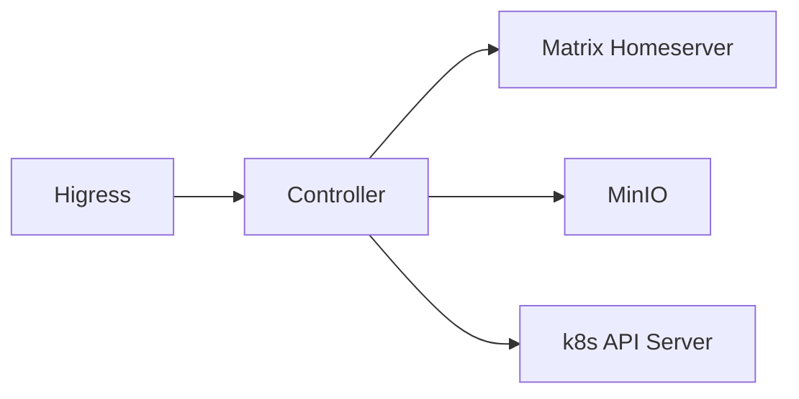

# Agent Chat & Dashboard Modernization

Feature Name: agent-chat-modernization
Updated: 2026-06-16

## Description

This design describes how TaDashboard introduces typing indicators,
Markdown / HTML / A2UI rendering, a top-bar Activity Feed, and a
modern Dashboard visual idiom across all 13 sections, while keeping
the existing Matrix proxy and HiClaw API plumbing intact. The feature
is gated by a per-browser `modernChatEnabled` flag so operators can
revert to legacy rendering without a redeploy.

The driving constraints are:

1. The Controller is the authority for Worker / Team / Human / Manager
   state. The dashboard consumes whatever the Controller exposes and
   degrades gracefully when new metadata is absent.
2. All chat and Dashboard upgrades sit behind the existing
   `src/app/api/matrix/proxy-helper.ts` and
   `src/app/api/hiclaw/proxy-helper.ts` reverse proxies. The
   dashboard never opens a direct socket to a homeserver or the
   Controller.
3. Existing Sanitize allow-list and `AUDIT_WRITE_TOKEN` model are
   the baseline. New code does not bypass them.

## Architecture

### High-level flow



### Modern renderer layering



### Feature flag plumbing



### Component health topology



## Components and Interfaces

### `src/lib/ui-store.ts` (new)

- Zustand store with `persist` middleware keyed to localStorage.
- State: `modernChatEnabled: boolean` (default `true`),
  `modernChromeEnabled: boolean` (default `true`).
- Actions: `setModernChatEnabled(v)`, `setModernChromeEnabled(v)`.

### `src/lib/typing.ts` (new)

Pure functions and TanStack-Query hooks for Matrix `m.typing` events.

- `useTypingPublisher(roomId)` — publishes `m.typing` while the local
  user is composing. Throttled to one publish every 4 s, cleared on
  input empty or room change.
- `useTypingObserver(roomId)` — fetches `m.typing` events from the
  proxy (Matrix supports a per-room typing list via the sync stream;
  we cache the most recent snapshot via a TanStack Query with a
  3-second `refetchInterval` for the active room).
- Exposed helpers: `TypingRow` component (animated dots + sender
  name).

### `src/lib/a2ui.ts` (new)

A2UI v0.9 declarative renderer.

- `parseA2UIPayload(body)` — accepts `body.a2ui`, `content.a2ui`, or a
  top-level A2UI document. Returns `A2UIDocument | null`.
- `renderA2UI(doc, ctx)` — recursive renderer that maps A2UI
  components to existing shadcn / Radix primitives (`Card`,
  `Button`, `Input`, `Textarea`, plus a custom `A2UIRow` /
  `A2UIColumn` layout helper).
- `validateA2UIUrl(url)` — reuses the existing proxy allow-list via
  `isAllowedMatrixHost` / `isAllowedHiclawHost`.
- Components handled: `text`, `image`, `button`, `text-input`,
  `form`, `row`, `column`, `card`. Unknown components render a
  muted "Unsupported A2UI component: <name>" badge.

### `src/lib/markdown.ts` (new)

Lightweight Markdown rendering fallback for `formatted_body` that
the Controller did not pre-render.

- `renderInlineMarkdown(src)` — uses `remark-parse` + `remark-gfm`
  + `remark-rehype` + `rehype-sanitize` + `rehype-stringify`.
- Returns sanitized HTML that the existing
  `matrix-html-content` CSS class already styles.

### `src/components/dashboard/activity-feed.tsx` (new)

Top-bar dropdown that lists the 20 most recent events.

- Data source: `/api/audit` GET plus an in-memory ring buffer fed by
  the existing TanStack Query cache for Matrix messages.
- Each row links to the relevant section (`#workers`, `#chat`,
  `#infrastructure`).
- Auto-refresh: 5-second poll when the popover is open.

### `src/components/dashboard/modern-chrome/` (new folder)

Shared visual scaffolding:

- `modern-card.tsx` — `Card` wrapper with `rounded-2xl`,
  `backdrop-blur-md`, gradient hairline border.
- `modern-section-header.tsx` — header matching the Mission Control
  idiom (icon, title, live dot, action cluster, description).
- `modern-grid.tsx` — responsive Bento grid helper.
- `use-modern-chrome.ts` — hook that returns the modern or legacy
  variant based on `useUiStore.modernChromeEnabled`.

### `src/app/api/activity/route.ts` (new)

A read endpoint that merges audit log + recent Matrix messages into a
single Activity Feed payload. Limits to the most recent 20 entries.

- Auth: same `AUDIT_WRITE_TOKEN` policy as `/api/audit` GET.
- Response: `ActivityFeedItem[]` with `id`, `kind`, `ts`, `actor`,
  `action`, `resource`, `resourceId`, `preview`, `link`.

### `src/components/dashboard/sections/infrastructure-section.tsx` (modify)

Replace the vertical list with an xyflow / React Flow node-and-edge
graph. The current section already calls `useInfrastructure()`; the
new layout wraps the response in a `ReactFlow` component with custom
node types per component (Controller, Higress, Matrix, MinIO, k8s).

### Section sweep

- `src/components/dashboard/sections/{overview,workers,teams,humans,
  managers,chat,infrastructure,k8s,skills,architecture,security,
  runtime,quickstart}-section.tsx` — each section wraps its content in
  the modern chrome when `modernChromeEnabled` is true. Sections that
  do not yet ship the modern chrome render a `ModernChromeFallback`
  with a TODO label so the gap is visible.

### Worker / Manager detail

- `src/components/dashboard/sections/workers-section.tsx` — add a
  per-card "Trace" link that points at the Controller's log endpoint
  when the Controller exposes one (probed via the existing
  `use-hiclaw-version` data; missing endpoint → link hidden, not
  broken).
- `src/components/dashboard/sections/managers-section.tsx` — add a
  "Coordinated Teams" panel using `useTeams()` + `useWorkers()`.

## Data Models

### Prisma (extend)

```prisma
model ActivityFeedItem {
  id          String   @id @default(cuid())
  kind        String   // "audit" | "matrix" | "infrastructure"
  ts          DateTime @default(now())
  actor       String?
  action      String?
  resource    String?
  resourceId  String?
  preview     String?  // ≤ 240 chars
  link        String?  // anchor route, e.g. "#workers"

  @@index([ts])
}
```

The existing `AuditLog` model remains the source of truth for
audit rows. `ActivityFeedItem` is a projection that the
`/api/activity` route maintains lazily (rebuild on read when
missing).

### Zustand: `useUiStore`

```ts
type UiState = {
  modernChatEnabled: boolean;
  modernChromeEnabled: boolean;
  setModernChatEnabled: (v: boolean) => void;
  setModernChromeEnabled: (v: boolean) => void;
};
```

Persisted to `localStorage` under `tadashboard.ui.v1`.

### Matrix `m.typing` ephemeral

- Outgoing: `PUT /api/matrix/rooms/{roomId}/typing` with
  `{ timeout: 30000 }` (we expose a new proxy route that forwards
  to the standard Matrix endpoint).
- Incoming: already present in `/api/matrix/sync` long-poll and in
  the existing `useMatrixRoomMessages` payload (we extend the
  formatter to surface `m.typing` events into a separate
  `typingUsers` list).

### A2UI wire format

We treat A2UI as a sub-document inside a Matrix message. The
canonical envelope:

```json
{
  "msgtype": "app.a2ui",
  "body": "<plain-text summary>",
  "a2ui": { "root": "card-1", "components": [ ... ] }
}
```

Unknown `msgtype` falls through to plain text.

## Correctness Properties

1. The typing publisher publishes at most one `m.typing` per 4 s
   per room, and stops within 1 s of input empty or room change.
2. Sanitized HTML never contains `<script>`, inline event handlers,
   or `javascript:` URLs. The `sanitizeHtml` function and the new
   Markdown pipeline both share the same allow-list (defined once in
   `src/lib/sanitize.ts`).
3. The Activity Feed never holds more than 20 entries.
4. When `modernChatEnabled` is `false`, the chat renders identically
   to the previous version. Verified by snapshot-style Vitest tests
   for `MessageBubble`.
5. When the Controller does not expose Skills / Trace endpoints,
   the corresponding UI shows a muted placeholder instead of
   crashing.
6. Feature flag toggles do not trigger data refetches beyond the
   matrix store's existing rehydrate flow.

## Error Handling

| Surface | Failure | Behaviour |
|---|---|---|
| Typing publish | Network error | Swallow silently, keep input usable. |
| Typing observer | Stale event > 6 s | Drop from typing row. |
| A2UI render | Unknown component | Muted fallback badge. |
| A2UI submit | Action proxy fails | Show inline error in card, keep form filled. |
| Markdown pipeline | Parser throws | Fall back to plain text bubble. |
| Activity Feed | `/api/activity` 5xx | Keep cached entries, no toast. |
| Feature flag | localStorage corrupt | Default both flags to `true`. |
| Modern chrome | Section lacks wrapper | Render via `ModernChromeFallback` with TODO label. |

Errors funnel through the existing `formatError` helper from
`src/lib/api-errors.ts`. New errors are added only when the existing
12-code catalogue cannot describe the failure.

## Test Strategy

- **Unit tests** (Vitest):
  - `tests/typing.test.ts` — throttling, cleanup, stale-event
    pruning.
  - `tests/a2ui.test.ts` — known components render, unknown
    component falls back, hostile payloads are dropped.
  - `tests/markdown.test.ts` — fenced code, inline code, line
    breaks, sanitization.
  - `tests/ui-store.test.ts` — default flag values, persistence
    round-trip, fallback when localStorage is unavailable.
  - `tests/activity-route.test.ts` — merge logic, 20-item cap,
    auth mirroring.
- **Component tests** (Vitest + `@testing-library/react`):
  - `MessageBubble` renders each branch (markdown / html / a2ui /
    plain).
  - `ActivityFeed` enforces 20-entry cap, click navigation.
  - `ModernChrome` toggle switches between modern and legacy.
- **Regression**:
  - Existing chat-section tests keep passing.
  - Existing 67-test suite remains green.

## Migration Plan

1. Land `ui-store.ts`, `typing.ts`, `a2ui.ts`, `markdown.ts` with
   tests. Legacy chat path is unchanged.
2. Land `ActivityFeed` (read-only) and the `/api/activity` route.
3. Land `ModernChrome` and the section sweep, one section at a time,
   starting with Overview → Workers → Managers → Chat.
4. Flip `modernChatEnabled` default to `true` once smoke testing
   passes; expose Kill Switch in `SettingsDialog`.
5. Remove the `ModernChromeFallback` placeholders once every
   section ships the modern chrome.

## References

[^1]: (Website) — Google A2UI v0.9 spec (a2ui.dev or current repo)
[^2]: (Website) — CopilotKit AG-UI protocol (docs.ag-ui.com)
[^3]: (Website) — Google A2A protocol (a2a-protocol.org)
[^4]: (Website) — Anthropic MCP (modelcontextprotocol.io)
[^5]: (Website) — xyflow / React Flow (reactflow.dev)
[^6]: (Filename#L343) — Existing Dashboard architecture
    (`.monkeycode/docs/ARCHITECTURE.md`)
[^7]: (Filename#L1125) — Current chat section
    (`src/components/dashboard/sections/chat-section.tsx`)
[^8]: (Filename#L148) — Matrix proxy helper
    (`src/app/api/matrix/proxy-helper.ts`)
[^9]: (Filename#L181) — HiClaw proxy helper
    (`src/app/api/hiclaw/proxy-helper.ts`)
[^10]: (Filename#L265) — ApiErrorCode catalogue
    (`src/lib/api-errors.ts`)