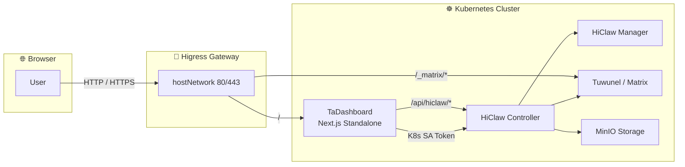
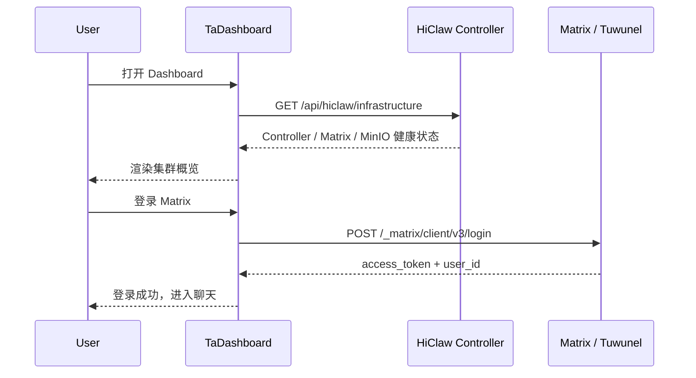

<div align="center">

# ✨ TaDashboard

**The Cloud-Native Command Center for HiClaw AI Agent Clusters**

[](https://nextjs.org/)
[](https://react.dev/)
[](https://www.typescriptlang.org/)
[](https://tailwindcss.com/)
[](./LICENSE)
[](https://github.com/higress-group/TaDashboard/tree/dream)

<p align="center">
  <strong>统一可视化管理 Worker · Team · Human · Manager · Gateway Consumer · Matrix 协作</strong>
</p>

<p align="center">
  <a href="#-features">功能特性</a> ·
  <a href="#-architecture">架构</a> ·
  <a href="#-quick-start">快速开始</a> ·
  <a href="#-deployment">部署方式</a> ·
  <a href="#-tech-stack">技术栈</a>
</p>

</div>

---

## 🌟 项目简介

**TaDashboard** 是 [HiClaw](https://github.com/higress-group/hiclaw) 的官方管理面板，为 AI Agent 团队提供企业级的集群可视化管理能力。

无论你是运行几十个 Worker 的推理集群，还是构建多团队协作的 Agent 编排平台，TaDashboard 都能让你在一个界面中完成：

- 👁️ 实时洞察集群健康、资源状态、运行时指标
- 🤖 管理 Worker / Team / Human / Manager 全生命周期
- 💬 通过 Matrix 与 Agent、Human、Manager 实时协作
- 🛡️ 统一认证、审计、权限与安全策略
- 🚀 一键对接 Higress 网关，实现 Consumer 认证与流量治理

> 🎯 **设计理念**：Dashboard 只保留本地 UI 状态，所有权威资源状态由 HiClaw Controller 托管，确保单点 truth source 与集群级一致性。

---

## 🖼️ 界面预览

> 以下截图为示意，实际界面以运行版本为准。

| 全局概览 | Worker 管理 | Matrix 协作 |
|---|---|---|
|  |  |  |

---

## 🏗️ 架构



### 数据流



---

## 🚀 功能特性

| 模块 | 能力 | 状态 |
|---|---|---|
| 📊 **Overview** | 集群全局概览：活跃 Worker、Team、Matrix 房间、资源健康 | ✅ |
| 🤖 **Workers** | Worker 全生命周期：查看、唤醒、休眠、确保就绪、删除、指标追踪 | ✅ |
| 👥 **Teams** | Team CRUD、成员管理、关联 Worker / Human、详情弹窗 | ✅ |
| 🧑 **Humans** | Human 资源管理、权限级别、房间关联、卡片/表格视图 | ✅ |
| 🎩 **Managers** | Manager 配置、模型选择、欢迎消息、团队协调 | ✅ |
| ☸️ **Kubernetes** | CRD 资源卡片、YAML / JSON 预览 | ✅ |
| 🏥 **Infrastructure** | Controller / Matrix / MinIO / Higress 健康状态 | ✅ |
| 💬 **Chat** | Matrix 聊天集成：房间列表、成员、消息收发、已读状态 | ✅ |
| 🛡️ **Security** | 权限矩阵、访问控制、安全策略展示 | ✅ |
| 🧩 **Skills** | Skill / MCP 资源管理 | ✅ |
| 🏛️ **Architecture** | 架构图与组件关系说明 | ✅ |
| ⚡ **Quickstart** | 快速上手指引与状态检查清单 | ✅ |

---

## ⚡ 快速开始

### 方式一：Docker Compose（本地体验，推荐）

```bash
# 1. 克隆项目
git clone -b dream https://github.com/higress-group/TaDashboard.git
cd TaDashboard

# 2. 配置环境变量
cp .env.example .env

# 3. 启动 Dashboard + Mock Controller
docker compose up -d

# 4. 访问
open http://localhost:3000
```

### 方式二：本地开发

```bash
# 前置：Bun 1.3+ 或 Node.js 20+
make install
cp .env.example .env.local
make db-push
make dev
```

### 方式三：对接已部署的 HiClaw Helm Release

```bash
# 1. 确保 HiClaw 已通过 Helm 部署
helm install hiclaw higress.io/hiclaw -n hiclaw-system --create-namespace

# 2. 构建并部署 Dashboard 叠加层
scripts/build-and-load-image.sh
scripts/deploy-with-hiclaw.sh

# 3. 本地配置 hosts
# <NODE_IP> dashboard.hiclaw.local
```

📖 完整整合部署文档：[docs/hiclaw-integration-deployment.md](./docs/hiclaw-integration-deployment.md)

---

## 📦 部署方式

| 场景 | 命令 | 说明 |
|---|---|---|
| 本地开发 | `make dev` | 热重载开发服务器 |
| 单机 Docker | `docker compose up -d` | 包含 Dashboard + Mock Controller |
| 生产 Caddy + TLS | `CADDY_DOMAIN=dash.example.com docker compose -f docker-compose.yml -f docker-compose.prod.yml up -d` | 自动 HTTPS |
| k3s 独立部署 | `make deploy-k3s` | 部署 Dashboard + Mock Controller |
| k3s 叠加部署 | `scripts/deploy-with-hiclaw.sh` | 只部署 Dashboard，复用 HiClaw Helm release |

---

## 🛠️ 技术栈

- **框架**：Next.js 16 + React 19 + TypeScript
- **样式**：Tailwind CSS v4 + shadcn/ui
- **状态管理**：Zustand + TanStack Query (React Query)
- **数据库**：SQLite + Prisma
- **构建工具**：Bun / Node.js 20+
- **容器化**：Docker 多阶段构建，Next.js standalone 输出
- **编排**：Docker Compose / Kubernetes (k3s)
- **网关**：Higress

---

## ⚙️ 核心环境变量

| 变量 | 用途 | 默认值 |
|---|---|---|
| `DATABASE_URL` | Prisma SQLite 数据库文件 | `file:./db/custom.db` |
| `HICLAW_CONTROLLER_URL` | 服务端访问 Controller 地址 | `http://hiclaw-controller.hiclaw-system:8090` |
| `NEXT_PUBLIC_HICLAW_CONTROLLER_URL` | 浏览器端可选直连 Controller 地址 | 空 |
| `HICLAW_AUTH_TOKEN` / `HICLAW_AUTH_TOKEN_FILE` | Controller Bearer Token 或投影 Token 文件 | 空 |
| `NEXT_PUBLIC_MATRIX_API_URL` | 浏览器访问 Matrix Homeserver URL | `http://localhost:6167` |
| `MATRIX_ALLOWED_HOSTS` | 服务端代理允许的额外 Matrix hosts | 空 |
| `NEXT_PUBLIC_MATRIX_TOKEN_PERSIST` | Matrix token 持久化策略 | `session` |

> 完整变量参见 [`.env.example`](./.env.example)。

---

## 🧩 项目结构

```text
TaDashboard/
├── src/
│   ├── app/
│   │   ├── api/hiclaw/        # HiClaw Controller 代理 API
│   │   ├── api/matrix/        # Matrix Homeserver 代理 API
│   │   ├── globals.css
│   │   ├── layout.tsx
│   │   └── page.tsx
│   ├── components/
│   │   ├── dashboard/         # 面板业务组件
│   │   │   ├── sections/      # 各功能区域组件
│   │   │   └── hi-claw-dashboard.tsx
│   │   └── ui/                # shadcn/ui 基础组件
│   ├── hooks/                 # TanStack Query + 业务 Hooks
│   └── lib/                   # 工具函数、API 客户端、Store
├── prisma/
│   └── schema.prisma          # SQLite 数据模型
├── deploy/
│   ├── k3s/                   # 独立 k3s 部署（含 Mock Controller）
│   └── k3s-with-hiclaw/       # 叠加 HiClaw Helm 部署
├── scripts/                   # 部署辅助脚本
├── Dockerfile                 # 多阶段 Docker 构建
├── docker-compose.yml         # 单机 Docker Compose
├── docker-compose.prod.yml    # 生产级 Caddy + TLS
├── Makefile                   # 统一构建命令
├── Caddyfile                  # Caddy 反向代理配置
└── package.json
```

---

## 🔒 安全注意事项

- 容器以非 root 用户运行，并启用只读根文件系统。
- Dashboard 通过 K8s projected ServiceAccount Token 访问 Controller，Token 每次请求重新读取，支持自动轮转。
- 已移除全局 `Access-Control-Allow-Origin: *`，CORS 请在 Ingress / 网关层统一配置。
- `.env` 与本地数据库不应提交到 Git。
- 生产环境请使用私有镜像仓库、TLS、NetworkPolicy 和最小权限 ServiceAccount。

---

## 🤝 贡献

欢迎提交 Issue 和 Pull Request！

1. Fork 本仓库
2. 创建你的 Feature Branch (`git checkout -b feature/AmazingFeature`)
3. 提交更改 (`git commit -m 'Add some AmazingFeature'`)
4. 推送到 Branch (`git push origin feature/AmazingFeature`)
5. 打开 Pull Request

---

## 📄 许可证

本项目基于 [Apache 2.0](./LICENSE) 许可证开源。

---

## 🔗 相关仓库

- [TaDashboard](https://github.com/higress-group/TaDashboard)
- [HiClaw](https://github.com/higress-group/hiclaw) — AI Agent 集群 Controller
